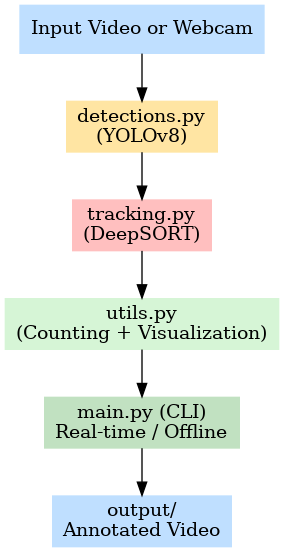

# Vehicle & Pedestrian Tracking with YOLOv8 and DeepSORT


---

This project implements a **multi-object detection, tracking, and counting system** using **YOLOv8** for detection and **DeepSORT** for tracking.

It supports:
- Offline video input
- Webcam real-time mode
- Saving annotated videos with bounding boxes, unique IDs, and per-class counts

**Applications:** traffic monitoring, pedestrian analysis, smart city solutions.

---

## Demo of Object Tracking & Counting on Vehicles and Pedestrians
This demo shows the system performing:  
- **Object detection** using YOLOv8  
- **Tracking with unique IDs** using DeepSORT  
- **Counting per class** (persons, cars, buses, trucks, bicycles, etc.)


---

## Features
- Detects and tracks: Person, Bicycle, Car, Motorcycle, Bus, Truck
- Assigns **Unique ID** to tracked object
- **Object counting** per class across the video
- Annotates video frames with **bounding boxes, IDs, and confidence scores**
- Saves annotated videos automatically

---

## Technologies & Skills Used
- **Programming:** Python 3.8+
- **Detection:** YOLOv8 (Ultralytics)
- **Tracking:** DeepSORT (deep-sort-realtime)
- **Visualization:** OpenCV
- **Utilities:** NumPy, argparse, logging

---

## Project Overview
Monitoring vehicles and pedestrians is crucial for traffic analysis, road safety, and smart city applications. This project integrates **YOLOv8** for fast object detection, **DeepSORT** for robust multi-object tracking, and a custom counting system for per-class analytics.

---

## Project Structure

```
    yolov8-deepsort-object-tracking/
    │
    ├── assets/
    │   ├── demo.gif
    │   └── pipeline_diagram.png
    ├── data/                           # Place your input videos here
    │   ├── crosswalk_traffic.mp4
    │   └── traffic_night.mp4
    ├── Yolo-Weights/                   # YOLOv8 weights (n, s, m)
    │   ├── yolov8n.pt
    │   ├── yolov8s.pt
    │   └── yolov8m.pt
    ├── detections.py                   # YOLOv8 detection wrapper
    ├── tracking.py                     # DeepSORT tracking wrapper
    ├── utils.py                        # Visualization & utilities
    ├── main.py                         # CLI pipeline
    ├── requirements.txt                # Dependencies for local development
    └── README.md
```

> **Note:** The `output/` folder is not tracked in the repository. It will be automatically created at runtime when you run the pipeline, and all annotated videos will be saved there.

---

## Project Pipeline
The system integrates **YOLOv8** for object detection, **DeepSORT** for object tracking, and a custom counting mechanism. Each stage is modularized into separate `.py` files:

1. **Detection (YOLOv8)** → [`detections.py`](detections.py)
- Uses YOLOv8 to detect objects in each frame.
- Outputs bounding box, confidence scores, and class IDs.

2. **Tracking (DeepSORT)** → [`tracking.py`](tracking.py)
- Uses DeepSORT to assign unique IDs to detected objects.
- Maintains object identity across frames.

3. **Visualization & Counting** → [`utils.py`](utils.py)
- Draws bounding box with IDs & confidence scores.
- Maintains unique object counts per class.

4. **Execution** → [`main.py`](main.py)
- Runs full pipeline in CLI (real-time / offline) mode.

### Pipeline Diagram


---

## Installation and Setup

### Prerequisites
Before running the project, make sure you have the following installed:

- **Python 3.8+**
- **pip** (Python package manager)
- **FFmpeg** (for OpenCV to handle video encoding/decoding)
- GPU acceleration optional (PyTorch with CUDA recommended)

### Installation steps

1. **Clone the Repository**
```bash
git clone https://github.com/Dhanvika27/yolov8-deepsort-object-tracking.git
cd yolov8-deepsort-object-tracking
```

2. **Create & Activate Virtual Environment**
```bash
# Create environment
python -m venv venv

# Activate environment (macOS/Linux)
source venv/bin/activate

# Activate environment (Windows)
venv\Scripts\activate
```

3. **Install Dependencies**
```bash
pip install -r requirements.txt
```

4. **Download YOLOv8 weights**
Example: medium version

```bash
mkdir -p Yolo-Weights
wget https://github.com/ultralytics/assets/releases/download/v0.0.0/yolov8m.pt -O Yolo-Weights/yolov8m.pt
```

> **Note:** Place them inside the `Yolo-Weights/` directory. Example: `Yolo-Weights/yolov8m.pt`.

---

## Usage

### Run from Command-Line (main.py)
Run in **real-time (webcam)**:

```bash
python main.py --input 0 --output output/webcam.mp4 --model Yolo-Weights/yolov8m.pt
```

Run on a **video file**:

```bash
python main.py --input data/crosswalk_traffic.mp4 --output output/result.mp4 --model Yolo-Weights/yolov8m.pt
```

**Arguments:**

- `--input` → Path to input video or `0` for webcam
- `--output` → Path to save processed video
- `--model` → Path to YOLOv8 model weights
- `--frame_width` → Resize display width (default:640)
- `--conf_thresh` → Confidence threshold (default: 0.4)

> **Note**: Annotated videos will be saved in the **`output/`** folder.

---

## Conclusion
This project demonstrates a practical pipeline for real-time object detection, tracking, and counting. By combining YOLOv8 and DeepSORT, it provides a robust multi-object tracking solution suitable for:

- Traffic monitoring
- Pedestrian safety analysis
- Smart city applications

---

## License
This project is released under the [MIT License](LICENSE). You are free to use, modify, and distribute it with proper attribution.